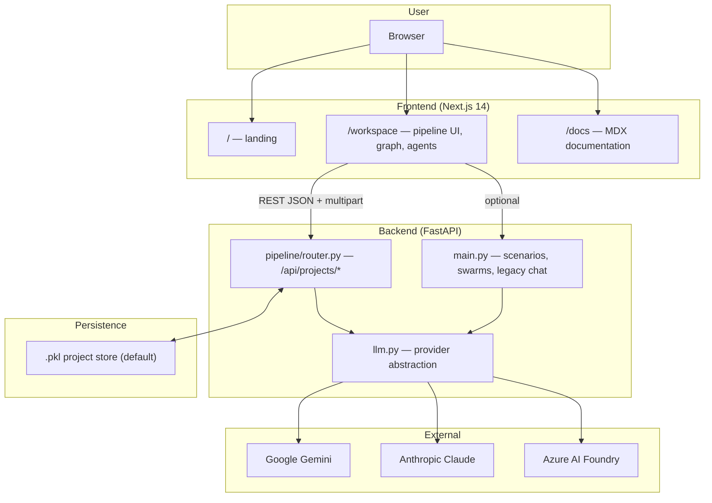
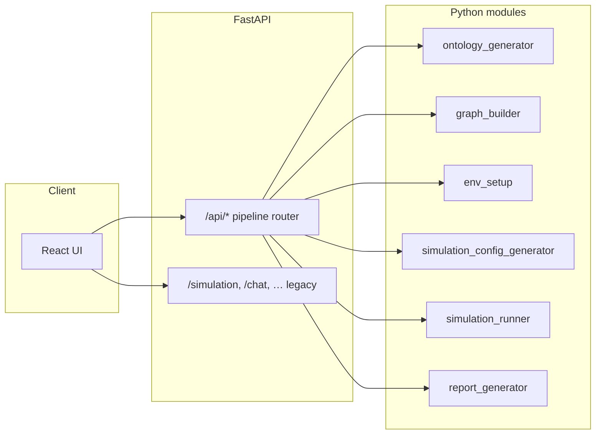
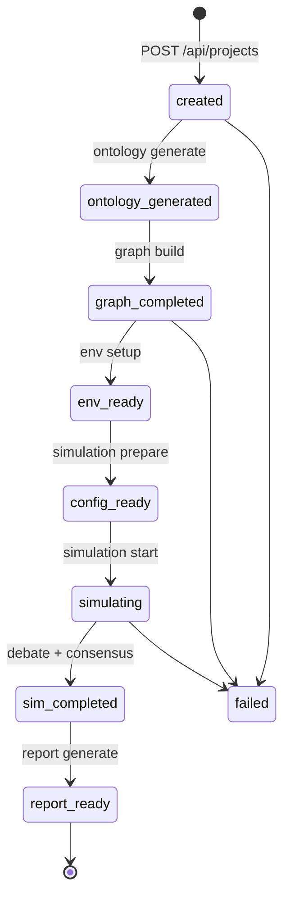
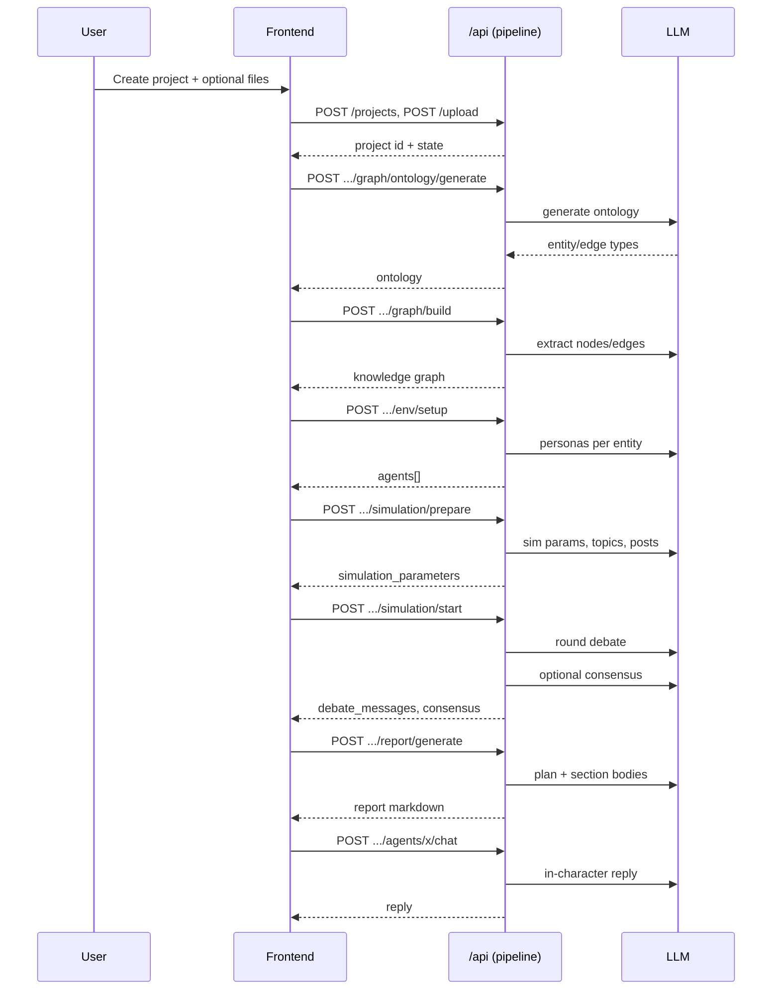
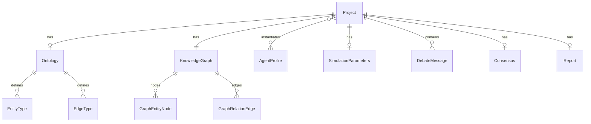
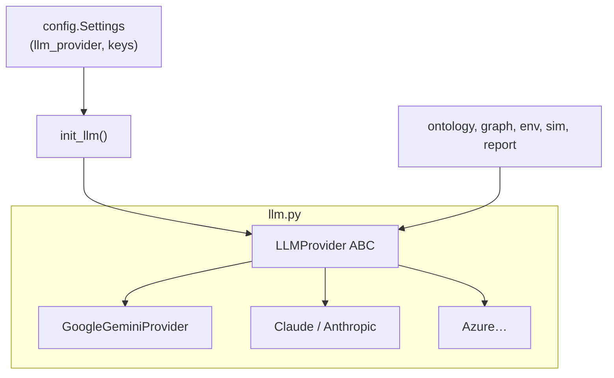

# TeamTwin / Quorum — Project overview, architecture, and pipeline

This document describes the **repository as implemented today**: the **Quorum** multi-agent reasoning platform (branded in the UI and README as *Quorum*; the repo folder is often named **TeamTwin**). It focuses on **architecture**, **flow**, and **why the pipeline is shaped the way it is**.

> **Note on other docs:** [`ARCHITECTURE.md`](./ARCHITECTURE.md) in this folder sketches a *different* “execution intelligence” vision (orchestrator, specialist agents, PostgreSQL). The **running application** in this repo is built around the **Quorum pipeline** under `backend/pipeline/` plus the **legacy scenario APIs** in `backend/main.py`. When in doubt, treat **this file** and the code under `backend/pipeline/` as the source of truth for the current product.

---

## 1. What the product does

**Quorum** is a self-hosted system for **structured multi-agent analysis**:

1. You provide a **brief** (and optionally **reality-seed documents**: PDF, Markdown, or text).
2. The system **designs a topic-specific schema** (ontology): entity types and relationship types.
3. It **extracts a knowledge graph** from the brief (and documents), typed against that schema.
4. It creates **one LLM agent per graph entity** (with personas, stance, and behavioral parameters).
5. It **prepares simulation parameters** (time/activity, narrative hooks, “platform”-style config, hot topics, starter posts).
6. It **runs a round-based debate** among agents, optionally with **consensus** extraction.
7. It produces a **multi-section prediction-style report** in Markdown, with **quoted agent voices**.
8. Afterward you can **chat with individual agents** in character.

The goal is not a free-form chat with one model, but a **repeatable, inspectable pipeline**: graph → many voices → argument → synthesis.

---

## 2. Design principles (reasoning)

| Principle | How it shows up in the system |
|------------|---------------------------------|
| **Schema before extraction** | The LLM first proposes **entity and edge types** for *this* topic. Extraction is then **constrained** to that vocabulary, which reduces noise and makes the graph legible. |
| **One agent per entity** | Debate is **perspectival**: each node in the world model gets a “voice.” That mirrors stakeholder modeling, wargames, and Delphi-style elicitation. |
| **Documents as context, not magic** | Uploads are **text extracted** and appended to the same context as the brief for ontology and graph steps—grounding without a separate RAG service in the default stack. |
| **Simulation parameters as a buffer** | A dedicated **prepare** step between “agents exist” and “run debate” lets the system inject **narrative, timing, and activity** so rounds feel like a scenario, not a single prompt. |
| **Report after consensus + transcript** | The **report** consumes **debate messages** and **consensus** (if any) so the final artifact is **traceable** to the run. |
| **Local-first persistence** | Projects are held in memory and **pickled** to disk so development survives `uvicorn --reload` without a database. Production can later swap the store (see `router.py` comments). |
| **LLM provider is pluggable** | `backend/llm.py` abstracts **Google Gemini**, **Anthropic Claude**, and **Azure** (see `config.py`), so the same pipeline runs on different vendors. |

---

## 3. High-level system context

**Communication:** the workspace uses **HTTP** (JSON; file upload as **multipart**). There is no required WebSocket for the core pipeline (polling or refetch of project state is enough).

---

## 4. Repository layout (mental map)

| Path | Role |
|------|------|
| `backend/main.py` | FastAPI app entry, CORS, **legacy** routes: domain presets, scenario initialization, debate/chat against **in-memory** `AgentPool` / `ScenarioSimulator` patterns. |
| `backend/pipeline/` | **Quorum product pipeline**: models, router, ontology, graph build, env setup, simulation config, runner, report. |
| `backend/llm.py` | Provider selection and **rate limits / retries** (e.g. Gemini 429 handling). |
| `backend/config.py` | Pydantic settings: LLM provider, API keys, optional Postgres/Redis URLs for future or Docker stacks. |
| `backend/core/`, `backend/domains/` | Shared types and **domain-specific** agent/graph helpers used by `main.py` (e.g. execution vs generic). |
| `frontend/app/` | Next.js App Router: `page.tsx` (home), `workspace/page.tsx`, `docs/[[...slug]]/page.tsx`. |
| `frontend/content/docs/` | User-facing documentation (Fumadocs). |
| `docs/` | Developer guides; **this file** is the high-level “whole project” overview. |
| `start.ps1` | Windows helper: spawns two terminals (backend venv + uvicorn, frontend npm). |

---

## 5. Runtime architecture (components)

- **Pipeline router** is the **project-centric** API the workspace uses.
- **Legacy `main` routes** are an alternate path: preset domains, ad-hoc scenarios, and chat; they reuse **core** abstractions and the same **LLM** layer.

---

## 6. Pipeline stages and state machine

### 6.1 `ProjectState` (backend source of truth)

Defined in `backend/pipeline/models.py`, roughly:

`created` → `ontology_generated` → `graph_building` / `graph_completed` → `env_ready` → `config_ready` → `simulating` → `sim_completed` → `report_ready` (or `failed`).

### 6.2 HTTP stages vs README “01–07” copy

The **README** user-facing list (ontology → graph → …) maps to **implementation** as follows:

| User-facing idea | Rough API / code stage |
|-------------------|-------------------------|
| Stage 0 — brief & uploads | `POST /api/projects`, `POST .../upload` |
| Ontology | `POST .../graph/ontology/generate` |
| GraphRAG / graph build | `POST .../graph/build` |
| Environment / agents | `POST .../env/setup` |
| Config + “activation” narrative | `POST .../simulation/prepare` (simulation parameters, hot topics, initial posts) |
| Run simulation | `POST .../simulation/start` |
| Report | `POST .../report/generate` |
| Chat with one agent | `POST .../agents/{id}/chat` |

The **router docstring** at the top of `router.py` uses a **short numbering** (five macro-stages + chat); the **README** splits some macro-steps for clarity. **Behavior** is the same: **order matters** because each step **depends on the artifacts** produced by the previous one.

### 6.3 End-to-end sequence (one project)

---

## 7. Why this pipeline order (reasoning, step by step)

1. **Ontology first**  
   Without a **shared vocabulary** (entity and relation types), free extraction tends to produce **inconsistent** node/edge labels. A schema makes later steps (UI, report, and “who said what”) **comparable** across projects.

2. **Graph second**  
   The graph is the **ground truth world model** for the rest. Everything downstream (agents, debate, report) is **anchored to entities and relations** rather than a single monolithic summary.

3. **Agents = f(graph)**  
   **One profile per node** (with caps like `max_agents` in `env_setup`) makes the **cost and behavior** of the run predictable and keeps roles **interpretable** (“this agent *is* this entity in the model”).

4. **Simulation prepare**  
   Raw personas are not enough for a **staged** debate: the prep step adds **narrative**, **time/activity**, **hot topics**, and **initial posts** so the simulation has **structure** (and hooks for multi-round selection of speakers).

5. **Debate then consensus**  
   The **transcript** is the primary **evidence trail**. **Consensus** (when generated) is a **compression** of the transcript for the report and for UX—not a replacement for the raw debate.

6. **Report last**  
   The report is intentionally **downstream** so it can **cite** debate content and (where available) consensus, rather than **hallucinating** a parallel narrative.

7. **Per-agent chat**  
   This is **optional** and does not mutate the core graph: it reuses the **agent persona** and project memory in `chat_with_agent` for **probing** a single stance after the run.

---

## 8. Data model (simplified)

- **`Ontology`**: `EntityType` + `EdgeType` lists.  
- **`KnowledgeGraph`**: `GraphEntityNode` + `GraphRelationEdge`.  
- **`AgentProfile`**: persona text, behavior sliders, optional demographics for UI.  
- **`SimulationParameters`**: produced by `simulation_config_generator.py` (narrative, events, per-agent sim config, etc.).

Project payloads returned by the API **summarize** large fields (e.g. **uploaded document text** is not echoed in full on every `GET` to avoid bloat—see `router._serialize_project`).

---

## 9. LLM abstraction

Configuration lives in `backend/config.py` (`llm_provider`, model names, API keys, Azure resource settings). The **same** `generate()`-style contract is used across **ontology** through **report** code paths.

---

## 10. Persistence and deployment

- **Default:** in-memory `dict` of projects, **atomically** written to a **pickle** file (path from `QUORUM_PROJECT_STORE_PATH` or `backend/.quorum_projects.pkl`). Rationale: fast iteration, full nested Python objects, **no** migration burden for local dev.  
- **Docker:** `backend/Dockerfile` uses **Python 3.11**; `docker-compose` (per README) runs backend + frontend with a **volume** for project data.  
- **Optional future:** `requirements.txt` includes **SQLAlchemy** and **psycopg2-binary** for a **Postgres**-backed store; **router** comments already describe swapping only the project store. Redis/Zep strings in `config` are **hooks** for memory features, not required for the default pipeline.

---

## 11. How this relates to `main.py` “domains”

- **`backend/domains/*`** and **`backend/core/*`** power **older / alternate** flows exposed on **`main.py`**: e.g. **execution** vs **generic** swarms, scenario lifecycle, in-memory `AgentPool`.  
- The **Quorum workspace** is driven by **`backend/pipeline/router.py`**.  
- Both paths share **LLM** and similar **knowledge** ideas, but **state** and **API shapes** differ. For **new features** in the product UI, prefer extending **`pipeline/`** and the project model unless you intentionally extend the **legacy** API.

For adding domain-like behavior, see also [`ADDING_DOMAINS.md`](./ADDING_DOMAINS.md) (swarm / generic domain style) and [`EXTENDING.md`](./EXTENDING.md) (older agent/orchestrator patterns—**may not all exist** in the current tree; verify against the repo).

---

## 12. Quick reference: key files

| Concern | File(s) |
|---------|---------|
| Project lifecycle + routes | `backend/pipeline/router.py` |
| State enum + dataclasses | `backend/pipeline/models.py` |
| Ontology LLM | `backend/pipeline/ontology_generator.py` |
| Graph extract | `backend/pipeline/graph_builder.py` |
| Personas | `backend/pipeline/env_setup.py` |
| Sim config | `backend/pipeline/simulation_config_generator.py` |
| Debate + consensus + chat | `backend/pipeline/simulation_runner.py` |
| Report | `backend/pipeline/report_generator.py` |
| File ingest | `backend/pipeline/file_parser.py` |
| LLM | `backend/llm.py` |
| App entry | `backend/main.py` |

---

## 13. Suggested reading order

1. **This file** — architecture and pipeline reasoning.  
2. **Root `README.md`** — install, user-facing stage list, Docker.  
3. **`backend/pipeline/router.py`** — exact endpoints and stage comments.  
4. **Frontend** — `frontend/app/workspace/page.tsx` (and related components) for how the UI drives the flow.  
5. **In-app docs** — `http://localhost:3000/docs` when the dev server is running.

---

*Last aligned with the repository layout and `backend/pipeline` implementation. If you add major features, update the state diagram and table in section 6 when endpoint names or `ProjectState` change.*
